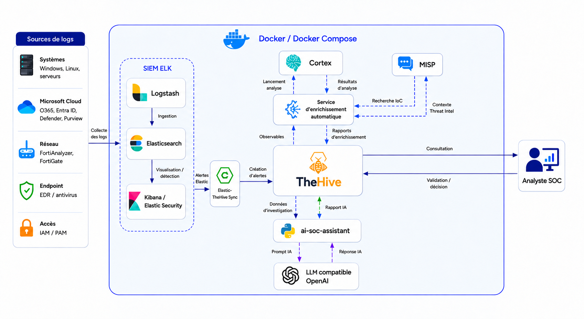

# SOC Lab Platform

> A self-hosted Security Operations Center lab for detection engineering, alert triage, threat-intelligence enrichment, SOAR experimentation, and AI-assisted investigations.

[](https://docs.docker.com/compose/)
[](https://www.python.org/)
[](https://www.elastic.co/elastic-stack/)
[](#security-and-scope)

SOC Lab Platform brings together Elastic Stack, TheHive, Cortex, MISP, Shuffle, and a lightweight AI assistant in one Docker Compose environment. It is intended for learning, demonstrations, detection-rule testing, and repeatable SOC workflow experiments—not production deployment.

## Why this project?

Modern SOC tooling is often difficult to evaluate as a complete workflow. This project provides a reproducible environment where you can:

- ingest or generate security telemetry;
- build and test Elastic detection rules;
- forward alerts from Elastic to TheHive;
- extract and enrich observables with Cortex and MISP;
- experiment with Shuffle automation workflows;
- generate structured investigation reports with an OpenAI-compatible LLM;
- replay SSH brute-force, SQL-injection, and Microsoft 365 sharing scenarios.

## Architecture



The diagram shows the complete path from telemetry collection and Elastic detection to TheHive case management, Cortex/MISP enrichment, AI-assisted reporting, and analyst validation.

### Investigation flow

1. Logs or simulated events are indexed in Elasticsearch.
2. Elastic detection rules create security alerts.
3. The synchronization worker creates corresponding alerts in TheHive.
4. Cortex enriches extracted IP addresses, URLs, domains, and hostnames.
5. The AI assistant selects a playbook and evaluates the available evidence.
6. A structured report can be written back to the original TheHive alert.

## Components

| Component | Purpose | Default endpoint |
| --- | --- | --- |
| Elasticsearch | Event and alert storage | `http://localhost:9200` |
| Kibana | Search, dashboards, and detection rules | `http://localhost:5601` |
| Logstash | Log ingestion and normalization | `5044`, `5000`, `9600` |
| TheHive | Alert and case management | `http://localhost:9000` |
| Cortex | Observable analysis and enrichment | `http://localhost:9001` |
| MISP | Threat-intelligence management | `https://localhost:8443` |
| Shuffle | SOAR workflow automation | `http://localhost:3001` |
| MinIO | TheHive object storage | `http://localhost:9003` |
| Portainer | Container management | `http://localhost:9004` |
| AI SOC assistant | Playbook-driven alert analysis | Background worker / CLI |

## Included detection scenarios

| Scenario | Data source | Detection approach | Supporting content |
| --- | --- | --- | --- |
| SSH brute force | Linux/SSH events | Repeated authentication failures | Generator and playbook |
| SQL injection | Web/WAF-style events | Suspicious request patterns | Sample alert and playbook |
| Microsoft 365 mass sharing | SharePoint/OneDrive audit events | Per-user and source-IP threshold | Event generator, Elastic rule, and playbook |

All sample identities, domains, and event data are synthetic and intended only for laboratory use.

## Prerequisites

- Docker Engine with Docker Compose v2
- Python 3.11 or newer for local helper scripts
- At least 12 GB of available RAM recommended for the complete stack
- Sufficient disk space for Elasticsearch, Cassandra, MISP, and container images
- An optional OpenAI-compatible API key for AI-assisted analysis

Linux is the primary target environment. Some services mount the Docker socket and require elevated container privileges.

## Quick start

### 1. Clone the repository

```bash
git clone https://github.com/IsMah01/Soc.git
cd Soc
```

### 2. Create the local configuration

```bash
cp .env.example .env
```

Open `.env` and replace every `replace_with_...` value. Generate unique secrets for each service; do not reuse the example values.

The AI integration is optional. Leave `LLM_API_KEY` empty if you only want to use the core SOC stack.

### 3. Start the lab

```bash
docker compose up -d --build
```

### 4. Check service health

```bash
docker compose ps
```

Large services such as Elasticsearch, Cassandra, TheHive, and MISP can take several minutes to become ready on the first start.

### 5. Open the interfaces

- Kibana: <http://localhost:5601>
- TheHive: <http://localhost:9000>
- Cortex: <http://localhost:9001>
- Shuffle: <http://localhost:3001>
- MISP: <https://localhost:8443>
- Portainer: <http://localhost:9004>

## Configuration

The root `.env.example` documents all configuration variables. The main groups are:

| Group | Variables |
| --- | --- |
| Elastic Stack | `ELASTIC_VERSION`, `ELASTIC_PASSWORD`, `KIBANA_PASSWORD`, `KIBANA_ENCRYPTION_KEY` |
| TheHive | `THEHIVE_VERSION`, `THEHIVE_SECRET`, `THEHIVE_API_KEY` |
| Cortex | `CORTEX_VERSION`, `CORTEX_SECRET`, `CORTEX_API_KEY`, `CORTEX_URL` |
| AI assistant | `LLM_PROVIDER`, `LLM_BASE_URL`, `LLM_MODEL`, `LLM_API_KEY` |
| Storage | `CASSANDRA_VERSION`, `MINIO_ROOT_USER`, `MINIO_ROOT_PASSWORD`, `REDIS_PASSWORD` |
| MISP | `MISP_ADMIN_PASSPHRASE`, `MISP_DB_PASSWORD`, `MISP_DB_ROOT_PASSWORD`, `MISP_REDIS_PASSWORD` |
| Shuffle | `SHUFFLE_VERSION`, `SHUFFLE_OPENSEARCH_PASSWORD`, `SHUFFLE_ENCRYPTION_MODIFIER` |

The `.env` file is excluded from Git. Never place real credentials in `.env.example`, source code, documentation, sample events, or screenshots.

## Run the AI SOC assistant locally

Create a Python environment and install the dependencies:

```bash
python -m venv .venv
source .venv/bin/activate
pip install -r ai-soc-assistant/requirements.txt
```

Analyze the included SQL-injection sample:

```bash
cd ai-soc-assistant
python app.py --sample samples/sample_sql_injection_alert.json
```

Preview the generated prompt without calling an LLM:

```bash
python app.py --sample samples/sample_sql_injection_alert.json --show-prompt
```

Analyze a TheHive alert and write the report back:

```bash
python app.py --alert-id '~123456789' --write-back
```

Run one automation cycle:

```bash
python auto_worker.py --once
```

When the stack is running, the `ai-soc-automation` container continuously executes the same worker process.

## Test the detection pipeline

Create or update the tuned Microsoft 365 mass-sharing rule:

```bash
python scripts/upsert_o365_elastic_rule.py --profile tuned
```

Inject synthetic Microsoft 365 sharing events:

```bash
python scripts/inject_o365_mass_sharing_events.py
```

Send synthetic SSH brute-force events:

```bash
python scripts/send_ssh_bruteforce_logs.py
```

Explore the general event generator:

```bash
python mini_soc_alert_generator.py --help
```

These scripts are designed for an isolated lab. Review their target URLs and credentials before running them.

## Repository layout

```text
.
├── ai-soc-assistant/
│   ├── playbooks/       # Investigation and response guidance
│   ├── prompts/         # LLM analysis instructions
│   ├── rules/           # Elastic detection-rule definitions
│   ├── samples/         # Synthetic alert documents
│   └── outputs/         # Generated reports; ignored by Git
├── cortex/                 # Cortex configuration and analyzers
├── elasticsearch/          # Elasticsearch configuration
├── kibana/                 # Kibana configuration
├── logstash/               # Logstash configuration and pipeline
├── misp/                   # MISP templates and initialization
├── scripts/                # Scenario and rule-management helpers
├── thehive/                # TheHive configuration
├── docker-compose.yml      # Complete lab topology
├── sync.py                 # Elastic-to-TheHive synchronization
└── .env.example            # Safe configuration template
```

## Logs and troubleshooting

Follow the main workers:

```bash
docker logs -f elastic-thehive-sync
docker logs -f ai-soc-automation
```

Inspect the core services:

```bash
docker logs -f elasticsearch
docker logs -f thehive
```

Check Elasticsearch health:

```bash
curl -u "elastic:${ELASTIC_PASSWORD}" \
  http://localhost:9200/_cluster/health
```

If TheHive is not ready, inspect its dependencies:

```bash
docker compose ps cassandra minio thehive-redis elasticsearch thehive
```

If AI reports are not generated, verify that:

- `LLM_API_KEY`, `THEHIVE_API_KEY`, and `CORTEX_API_KEY` are valid;
- TheHive and Cortex are reachable from the assistant container;
- the target alert is still eligible for processing;
- the alert ID is not already recorded in `ai-soc-assistant/outputs/automation_state.json`.

## Stop or reset the lab

Stop the containers while keeping their data:

```bash
docker compose down
```

Delete containers and persistent volumes:

```bash
docker compose down -v
```

> **Warning:** `docker compose down -v` permanently removes the lab data stored in Docker volumes.

## Security and scope

This repository is a learning and testing environment. It is not hardened for production.

- Bind services to trusted interfaces and restrict access with a firewall.
- Replace every placeholder with a unique secret before starting the stack.
- Never expose Elasticsearch, TheHive, Cortex, MISP, MinIO, or Portainer directly to the Internet.
- Treat containers with access to `/var/run/docker.sock` as privileged.
- Review generated reports before sharing them; they may contain alert evidence or observables.
- Rotate credentials immediately if they are committed, logged, or otherwise disclosed.
- Use only synthetic or authorized telemetry and targets.

Local secrets, reports, logs, caches, presentation files, and generated outputs are intentionally excluded through `.gitignore`.

## Contributing

Issues and pull requests are welcome. Keep contributions organization-neutral, use synthetic sample data, and never include credentials, customer information, or production telemetry.

When adding a new detection scenario, include:

1. a representative synthetic event or generator;
2. the detection logic or rule;
3. a corresponding investigation playbook;
4. expected results and tuning guidance.

## Disclaimer

Use this project only in environments and against systems you own or are explicitly authorized to test. The maintainers are not responsible for misuse, data loss, or exposure caused by insecure deployment.
